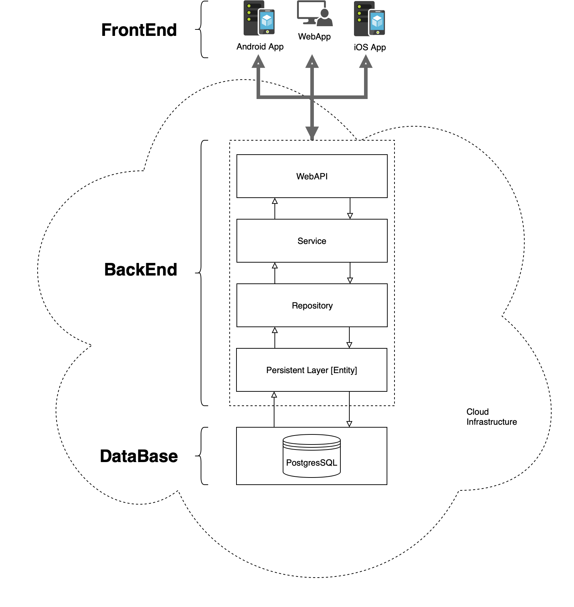
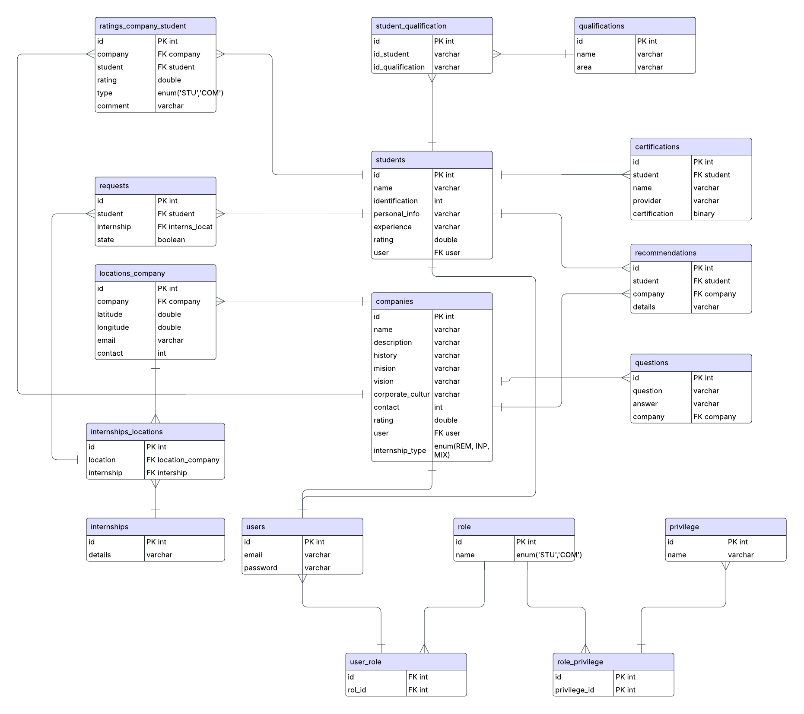

# Backend for Oportunia
The Oportunia represents a distributed system based on layers and interactions with different components.

## Skills 

## App Architecture

### Persistent or Data Layer

The persistence layer contains components for data access, such as an **object-relational mapping** (**ORM**) tool.

The objective is to interact with the data base.

The main objects are the Entities and the relationship between them.

### Data Base

PostgreSQL: The World's Most Advanced Open Source Relational Database

# General terms

## Distributed system

This backend is built using an N-Tier (multi-layer) architecture, which clearly separates
responsibilities between presentation, business logic, domain, and data. Its purpose is to
provide secure and scalable REST services that interact with the mobile frontend, while also
integrating smart features using the OpenAI API

## Key Features

- **JWT-based authentication and authorization** (JSON Web Tokens)
- **Well-structured REST services**
- **Integration with OpenAI API** for content generation and intelligent processing
